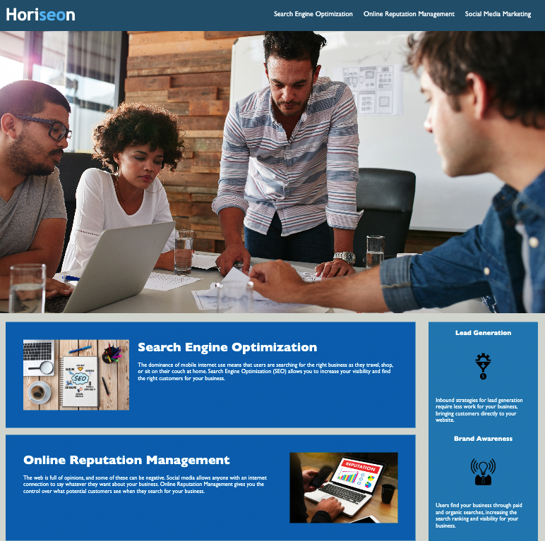

# Horiseon Accessibility Code Refactor

[Click here to view final version of webpage](https://kcschaefs.github.io/semantic_html/)

## User Story
A marketing agency wants to update their code base to better follow accessibility standards. This will allow them to be better optimized for SEO.

## Tasks

- HTML semantic refactoring
- Added alt image text to images and icons
- Updated the title
- ordered headers to better reflect size and importance
- changed some color choices to be more accessible
- restructured html code to be more optimized

## Learnings
- Sometimes coding per "best practice" (lines breaks, etc.) can make the code harder for others to read. It's ok to change best practice code formats to make things easier to read/update.

- Just because something *can* be coded a certain way, doesn't mean it is the best/most optimized way. 

- Using semantic tags can make your pages more accessible for those using screen readers as well as helping them to perform better on search engines.

- I should do better about tracking my changes and commenting. In order to review my code, I had to pull up the original code base. This is inefficient and wasted a lot of review time.

## Future Improvements
I would like to make this page much more accessible according to web accessibility guidelines. These updates would include ensuring all visual elements are accessible (colors, etc.)
